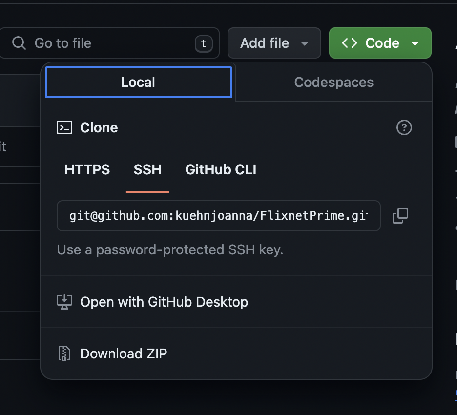

# FlixnetPrime

## Checkout Repository

### Open Terminal

```git 
git clone https://github.com/kuehnjoanna/FlixnetPrime.git
```



## Create new Branch


#### In Terminal
```git
git checkout -b {branchName}
```

Assign Issue
https://github.com/kuehnjoanna/FlixnetPrime/issues


## Ergebnis unseres Gespräches im letzte Huddle

Durch die Issues gehen, ggf. Anpassungen, wenn noch was einfällt.
Ansonsten gerne schon anfangen 1 oder 2 abzuarbeiten. (Coden)